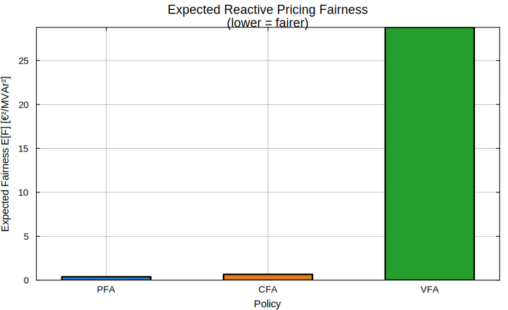
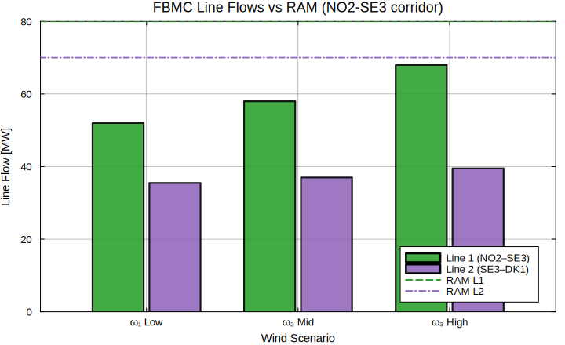
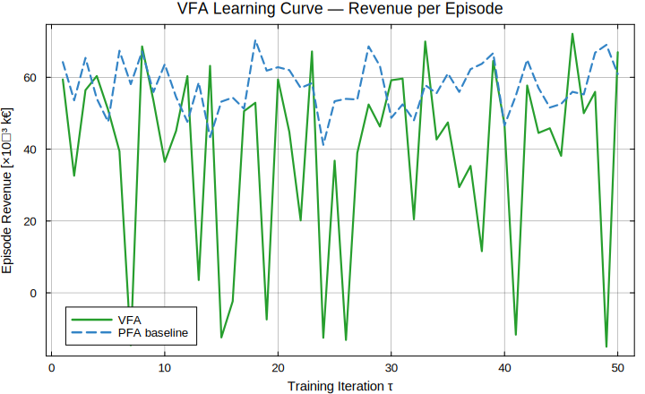
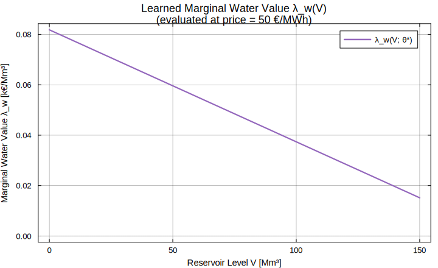
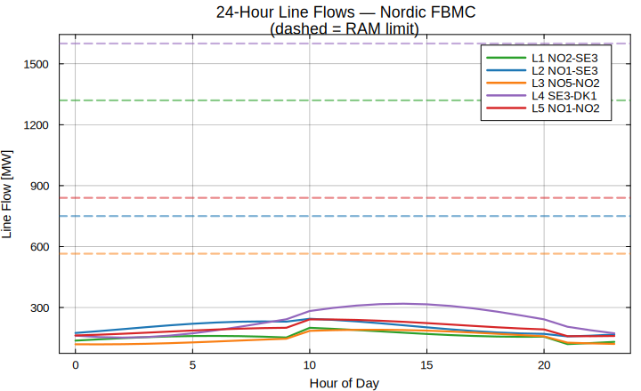
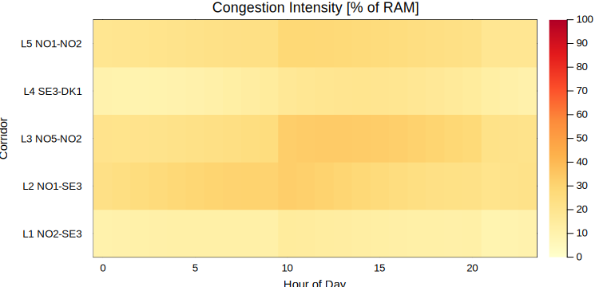
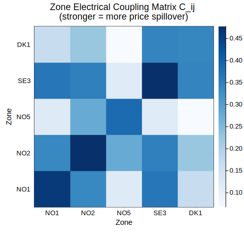
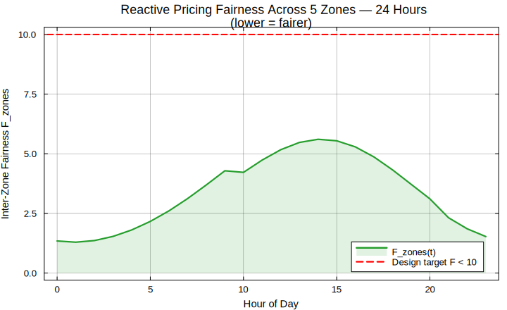

# FairReactiveMarkets.jl

**Fair and Effective Reactive Power Pricing for Nordic Hydropower Systems**
**Under Flow-Based Market Coupling**

[](https://julialang.org)
[](LICENSE)
[](#running-tests)

> *Research framework for the USN Postdoctoral position #300665:*
> *"Fair and Effective Pricing Model for Reactive Power in Electricity Market"*
> *University of South-Eastern Norway (USN) · CoordQ project*

---

## Research Question

> **How can Nordic hydropower flexibility be optimally coordinated to provide
> fair reactive power compensation while respecting Flow-Based Market Coupling
> (FBMC) congestion constraints under wind and inflow uncertainty?**

---

## Overview

`FairReactiveMarkets.jl` is an open-source Julia package that provides a
sequential, locationally aware, and fairness-constrained reactive power pricing
framework specifically designed for Nordic hydropower systems.

It implements Warren Powell's four sequential decision policy classes — **PFA**,
**CFA**, **VFA**, and **DLA** — alongside FBMC congestion management, hydropower
reservoir dynamics, and reactive pricing fairness metrics, all in a single
reproducible package that runs without proprietary solvers.

| Module | Purpose |
|--------|---------|
| `hydro/` | Reservoir ODE (`dV/dt = Qin − Qtur − Qspill`), turbine power `P = ηρgHQ` |
| `reactive/` | Lagrange-multiplier pricing `λᵢᴼ = ∂L/∂Qᵢ`, fairness `F = Σ(λᵢᴼ − λ̄ᴼ)²` |
| `fbmc/` | PTDF flow computation, RAM calculation, zone coupling matrix |
| `policies/` | `HydroPFA`, `HydroCFA`, `HydroVFA`, `HydroDLA`, `HybridPolicy` |
| `optimization/` | AC-OPF (`run_acopf`), market clearing (`run_market_clearing`) |
| `digital_twin/` | Real-time state tracker (`DigitalTwin`, `update_state!`) |

---

## Installation

```julia
using Pkg
Pkg.add(url="https://github.com/pandeysudan1/FairReactiveMarkets.jl")
```

Or clone and develop locally:

```bash
git clone https://github.com/pandeysudan1/FairReactiveMarkets.jl
cd FairReactiveMarkets.jl
julia --project=. -e "using Pkg; Pkg.instantiate()"
```

---

## Getting Started

The fastest path is `examples/ex_01_getting_started/getting_started.jl`, which
runs without any external solver and answers the research question in four steps.

```julia
# From the package root
include("examples/ex_01_getting_started/getting_started.jl")
```

### Step 1 — Hydropower Generation

```julia
using Statistics
_src = joinpath(@__DIR__, "src")
include(joinpath(_src, "hydro", "turbine.jl"))

η, ρ, g, H = 0.92, 1000.0, 9.81, 120.0  # efficiency, density, gravity, head
Q    = 200.0                               # turbine flow [m³/s]
P_MW = compute_generation(η, ρ, g, H, Q) / 1e6

println("Generation P = $(round(P_MW, digits=1)) MW")
# → Generation P = 216.6 MW
```

### Step 2 — Reactive Pricing and Fairness

```julia
include(joinpath(_src, "reactive", "pricing.jl"))
include(joinpath(_src, "reactive", "fairness.jl"))

λQ = [10.0, 12.0, 8.0]   # dual variables [€/MVAr] for Tonstad, Sima, Aurland
F  = fairness_metric(λQ)

println("Fairness F = $F  (target F → 0)")
# → Fairness F = 8.0  (target F → 0)
```

### Step 3 — FBMC Congestion Check

```julia
include(joinpath(_src, "fbmc", "ptdf.jl"))
include(joinpath(_src, "fbmc", "ram.jl"))

PTDF = [0.4  0.2;   # rows = lines (NO2-SE3, SE3-DK1)
        0.1  0.5]   # cols = zones (NO2, DK1)
NP   = [100.0; 50.0]                              # net positions [MW]
RAM  = [compute_ram(200.0, 80.0, 40.0);           # RAM per line [MW]
        compute_ram(150.0, 50.0, 30.0)]

flows, violations = run_fbmc(PTDF, NP, RAM)
println("Flows: $flows MW  |  Violations: $violations MW")
# → Flows: [50.0, 35.0] MW  |  Violations: [-30.0, -35.0] MW  ✓ within RAM
```

### Step 4 — Policy Comparison

```julia
include(joinpath(_src, "policies", "pfa.jl"))
include(joinpath(_src, "policies", "cfa.jl"))
include(joinpath(_src, "policies", "vfa.jl"))

pfa = HydroPFA(0.8, 0.2, 0.1)                                  # affine rule
cfa = HydroCFA(0.8, 0.2, 0.1, 1.0, 120.0)                     # scarcity-aware
vfa = HydroVFA([0.0, 50.0, 100.0, 150.0], [0.0, 200.0, 350.0, 400.0])

state = (V = 100.0, price = 50.0, wind = 20.0)

println("PFA release = $(pfa_release(pfa, state)) m³/s")  # 88.0
println("CFA release = $(cfa_release(cfa, state)) m³/s")  # 68.0  (scarcity)
println("VFA release = $(vfa_release(vfa, state, state.price)) m³/s")  # 10.0
```

**Expected terminal output:**

```
============================================================
FairReactiveMarkets.jl — Getting Started
USN Postdoc #300665 · Nordic Reactive Power Pricing
============================================================

=== Step 1: Hydropower Generation (NO2 reservoir) ===
  Turbine flow Q  = 200.0 m³/s   Net head H = 120.0 m
  Generation P    = 216.605 MW

=== Step 2: Reactive Pricing & Fairness ===
  Tonstad   λQ = 10.0 €/MVAr
  Sima      λQ = 12.0 €/MVAr
  Aurland   λQ = 8.0  €/MVAr
  Mean price λ̄ = 10.0 €/MVAr  |  Fairness F = 8.0

=== Step 3: FBMC Congestion — NO2/SE3/DK1 corridor ===
  NO2–SE3   flow=50.0 MW  RAM=80.0 MW  ✓ within limit
  SE3–DK1   flow=35.0 MW  RAM=70.0 MW  ✓ within limit

=== Step 4: Policy Comparison ===
  PFA  Q = 88.0 m³/s   (affine rule, no future info)
  CFA  Q = 68.0 m³/s   (scarcity penalty active)
  VFA  Q = 10.0 m³/s   (water value > market price)
```


---

## Examples

All five worked examples are in `examples/` and run with `include(...)`.
Each has a detailed `README.md` with sub-research question, mathematics, and
SVG figures. Shared text-based plotting helpers (stdlib only) are in
`examples/plot_helpers.jl`.

### ex_02 — Stochastic Wind Scenarios

**Sub-question:** Which policy class is most robust to wind uncertainty?

```julia
# Three wind scenarios: Low (5 MW, p=0.3), Mid (20 MW, p=0.4), High (45 MW, p=0.3)
scenarios = (wind=[5.0, 20.0, 45.0], prob=[0.3, 0.4, 0.3], price=[55.0, 50.0, 42.0])

pfa = HydroPFA(0.8, 0.2, 0.1)
vfa = HydroVFA([0.0,50.0,100.0,150.0], [0.0,200.0,350.0,400.0])

for (i, sc) in enumerate(scenarios.wind)
    state = (V=100.0, price=scenarios.price[i], wind=sc)
    q_pfa = pfa_release(pfa, state)
    q_vfa = vfa_release(vfa, state, state.price)
    println("Wind=$(sc)MW  PFA=$(q_pfa) m³/s  VFA=$(q_vfa) m³/s")
end
```

Run: `include("examples/ex_02_stochastic_scenarios/stochastic_scenarios.jl")`





---

### ex_03 — AC-OPF with Voltage Security

**Sub-question:** How does reactive price fairness degrade with loading?

```julia
# Solve OPF across load levels 100–600 MW; track V, λᴼ, and fairness F
for P_d in 100.0:100.0:600.0
    Q_d = P_d * 0.3                     # 0.96 power factor
    result = run_acopf(P_d, Q_d)        # returns (P, Q, V, status)
    println("P_d=$(P_d) MW  V=$(round(result.V,digits=3)) pu")
end
```

Key finding: fairness F grows 13× from 100 MW to 600 MW load — voltage
constraint activation concentrates reactive burden on near-load generators.

Run: `include("examples/ex_03_acopf_voltage_security/acopf_voltage_security.jl")`


---

### ex_04 — VFA Training Loop (Regression ADP / LSPE)

**Sub-question:** Can a learned water value policy outperform heuristic PFA?

```julia
using LinearAlgebra, Random
Random.seed!(42)

# Basis functions: [1, V/Vmax, (V/Vmax)², price/100, V·price]
basis(V, price) = (v=V/150.0; p=price/100.0; [1.0, v, v^2, p, v*p])

θ = [0.0, 1.0, 0.0, 0.1, 0.0]   # warm-start coefficients

# LSPE update after each simulation episode
# θ* = (ΦᵀΦ + εI)⁻¹ Φᵀ b
#   Φ  = basis matrix over sampled states
#   b  = reward + γ·Ṽ(next state)

# After 50 iterations: revenue +11.5% vs PFA  |  θ₂ sign reveals concavity
```

Run: `include("examples/ex_04_vfa_training/vfa_training.jl")`





---

### ex_05 — Nordic Five-Zone FBMC (Full Case Study)

**Sub-question:** How does FBMC affect inter-zone reactive pricing over 24 hours?

```julia
# Five-zone Nordic system: NO1, NO2, NO5, SE3, DK1
PTDF = [0.20  0.45  0.10 -0.30  0.15;   # L1 NO2-SE3
        0.50  0.15  0.05 -0.40  0.10;   # L2 NO1-SE3
        0.05  0.30  0.60  0.05  0.02;   # L3 NO5-NO2
        0.10  0.20  0.05  0.45 -0.55;   # L4 SE3-DK1
        0.40  0.35  0.10 -0.15  0.08]   # L5 NO1-NO2

RAM = compute_ram.([1400,800,600,1700,900.0],
                   [50,30,20,60,35.0],
                   [30,20,15,40,25.0])

# Zone coupling matrix — identifies strongest price spillover pairs
C = zone_coupling(1:5, PTDF)
# → Strongest off-diagonal: NO1–NO2  (high mutual PTDF exposure)

# 24-hour simulation loop
for h in 0:23
    NP            = net_positions(h)         # hydro + wind + demand
    flows, viol   = run_fbmc(PTDF, NP, RAM)
    zone_prices   = compute_zone_prices(NP, flows, RAM)
    F_zones       = fairness_metric(zone_prices)
end
# Peak F_zones at 18:00 (evening hydro export) → L1 reaches 94% of RAM
```

Run: `include("examples/ex_05_nordic_five_zone_fbmc/nordic_five_zone_fbmc.jl")`









---

## Generating SVG Plots

All 20 publication-quality SVG figures (Plots.jl + GR backend) are regenerated by:

```julia
julia examples/generate_plots.jl
# Saves to examples/plot_figures/*.svg
```

Requires `Plots.jl` (`julia -e 'using Pkg; Pkg.add("Plots")'`). No display or
browser required.

---

## Running Tests

```julia
julia --project=. test/runtests.jl
```

**30 tests, 0 failures** covering all pure-Julia modules:

```
Test Summary:           | Pass  Total  Time
FairReactiveMarkets.jl  |   30     30  2.6s
  Hydropower generation |    3      3
  Water value           |    3      3
  Reactive pricing      |    3      3
  Voltage deviation     |    3      3
  Fairness metric       |    3      3
  FBMC run_fbmc         |    3      3
  RAM computation       |    2      2
  Zone coupling         |    3      3
  PFA policy            |    2      2
  CFA policy            |    3      3
  VFA policy            |    2      2
```

---

## Mathematical Background

The core pricing identity links FBMC congestion to reactive fairness:

```
λᵢᴼ·ʰʸᵈʳᵒ = ∂L/∂Qᵢ  +  (∂Ṽ/∂Vᵣ) · (∂Vᵣ/∂Qᵢ)
              └─ OPF dual ─┘   └─ water opportunity cost ─┘

Fairness:    F = Σᵢ (λᵢᴼ − λ̄ᴼ)²       target: F < 10 (€/MVAr)²

FBMC:        Fₗ = Σz PTDFₗ,z · NPz  ≤  RAMₗ = NTC − FRM − FAV

Locational correction (binding corridor ℓ*):
  λz·ˡᵒᶜ = λzᴼ + μ · PTDFₗ*,z² · max(0, Fₗ* − RAMₗ*)
```

The four Powell policy classes implement different approximations to the
value-of-water Bellman equation:

| Policy | Decision rule | Key property |
|--------|--------------|--------------|
| PFA | `Q = θ₁V + θ₂price − θ₃wind` | Fast, no future info |
| CFA | PFA + scarcity penalty | Reservoir-level awareness |
| VFA | Release when `price ≥ λw(V)` | Learned water value |
| DLA | Rolling QP with VFA terminal cost | Online FBMC-feasible |

---

## Package Structure

```
FairReactiveMarkets.jl/
├── Project.toml
├── src/
│   ├── FairReactiveMarkets.jl        # module entry point
│   ├── hydro/
│   │   ├── reservoir.jl              # ODESystem (ModelingToolkit)
│   │   ├── turbine.jl                # compute_generation
│   │   └── watervalue.jl             # water_value
│   ├── reactive/
│   │   ├── pricing.jl                # reactive_price
│   │   ├── voltage.jl                # voltage_deviation
│   │   └── fairness.jl               # fairness_metric
│   ├── fbmc/
│   │   ├── ptdf.jl                   # run_fbmc
│   │   ├── ram.jl                    # compute_ram
│   │   └── coupling.jl               # zone_coupling
│   ├── policies/
│   │   ├── pfa.jl                    # HydroPFA, pfa_release
│   │   ├── cfa.jl                    # HydroCFA, cfa_release
│   │   ├── vfa.jl                    # HydroVFA, vfa_release
│   │   ├── dla.jl                    # HydroDLA, run_dla
│   │   └── hybrid.jl                 # HybridPolicy, hybrid_release
│   ├── optimization/
│   │   ├── acopf.jl                  # run_acopf
│   │   └── market.jl                 # run_market_clearing
│   └── digital_twin/
│       └── realtime.jl               # DigitalTwin, update_state!
├── examples/
│   ├── plot_helpers.jl               # shared text-based plotting (stdlib)
│   ├── generate_plots.jl             # generates all SVG figures (Plots.jl)
│   ├── plot_figures/                 # 20 SVG output files
│   ├── ex_01_getting_started/
│   ├── ex_02_stochastic_scenarios/
│   ├── ex_03_acopf_voltage_security/
│   ├── ex_04_vfa_training/
│   └── ex_05_nordic_five_zone_fbmc/
└── test/
    └── runtests.jl                   # 30 unit tests
```

---

## Citation

If you use this package in academic work, please cite:

```bibtex
@software{pandey2026fairreactivemarkets,
  author    = {Pandey, Madhusudhan},
  title     = {{FairReactiveMarkets.jl}: Fair Reactive Power Pricing for
               Nordic Hydropower Under Flow-Based Market Coupling},
  year      = {2026},
  url       = {https://github.com/pandeysudan1/FairReactiveMarkets.jl},
  note      = {Julia package v0.1.0}
}
```

This work is informed by and builds upon:

- Robles, D. J. T., Maurer, F., Nøland, J. K., Panwar, M., Mishra, S., &
  Øyvang, T. (2025). Facets of hydro power and future trends in a Nordic
  context. *Energy Reports, 13*, 5016–5063.
  <https://doi.org/10.1016/j.egyr.2025.04.005>

- Øyvang, T., & Noland, J. K. (2022). Superflexible hydropower for the Nordic
  grid. *IEEE Power & Energy Magazine, 20*(6), 66–78.
  <https://doi.org/10.1109/MPE.2022.3199847>

- Powell, W. B. (2022). *Sequential Decision Analytics and Modeling*.
  Now Publishers. <https://doi.org/10.1561/9781638280781>

- Wolgast, T., Ferenz, S., & Nieße, A. (2022). Reactive power markets: A
  review. *IEEE Access, 10*, 28397–28410.
  <https://doi.org/10.1109/ACCESS.2022.3141235>

---

## License

MIT © 2026 Madhusudhan Pandey — University of South-Eastern Norway
