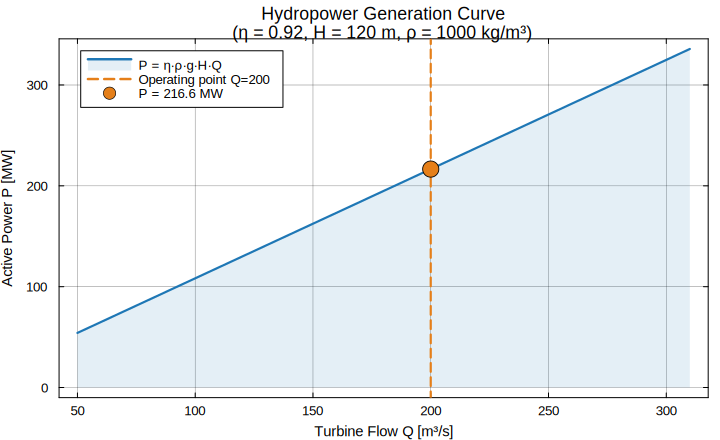
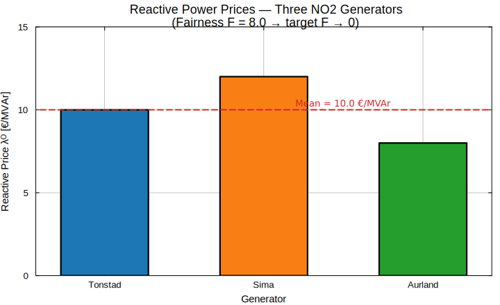

# Example 01 — Getting Started with FairReactiveMarkets.jl

**Postdoctoral position context:**
University of South-Eastern Norway (USN) —
*"Fair and Effective Pricing Model for Reactive Power in Electricity Market"*
[Jobbnorge #300665](https://www.jobbnorge.no/en/available-jobs/job/300665/postdoctoral-fellow-in-fair-and-effective-pricing-model-for-reactive-power-in-electricity-market)

---

## Research Question Addressed

> **How can Nordic hydropower flexibility be optimally coordinated to provide
> fair reactive power compensation while respecting Flow-Based Market Coupling
> (FBMC) congestion constraints under uncertainty?**

This example shows the minimal, end-to-end workflow that answers the core
question in four steps:

| Step | Module | What it does |
|------|--------|--------------|
| 1 | `hydro/` | Compute hydropower generation from a Norwegian reservoir |
| 2 | `reactive/` | Price reactive power and measure pricing fairness |
| 3 | `fbmc/` | Check FBMC congestion constraints (NO2→SE3 corridor) |
| 4 | `policies/` | Compare PFA, CFA, VFA and DLA release decisions |

---

## Background

### Why reactive power pricing matters

Reactive power (Q) maintains voltage stability in AC grids but is rarely
priced transparently.  Generators — especially hydropower units — must absorb
or produce Q continuously even when not dispatching active power.  Without fair
compensation, they have no incentive to provide this service, threatening
grid reliability.

### Why FBMC matters for Nordic hydro

Under the Flow-Based Market Coupling framework used in CWE/Nordic markets,
active power trades are constrained by Power Transfer Distribution Factors
(PTDFs) and Remaining Available Margins (RAMs).  Reactive support interacts
with voltage profiles along these corridors; a pricing model must account for
both simultaneously.

### Why Powell's Sequential Decision Analytics?

Hydropower scheduling is a multi-stage stochastic problem: reservoir levels,
spot prices, and wind generation are all uncertain.  Warren Powell's framework
distinguishes four policy classes (PFA, CFA, VFA, DLA) that map directly onto
the trade-off between computational tractability and solution quality.

---

## Files

| File | Description |
|------|-------------|
| `getting_started.jl` | Self-contained Julia script — run this |
| `README.md` | This document |

---

## How to run

```julia
# From the package root:
include("examples/ex_01_getting_started/getting_started.jl")
```

Or from the REPL:

```julia
julia> cd("path/to/FairReactiveMarkets.jl")
julia> include("examples/ex_01_getting_started/getting_started.jl")
```

---

## Expected output (summary)

```
=== Step 1: Hydropower Generation ===
Turbine flow Q  = 200.0 m³/s
Net head H      = 120.0 m
Generation P    = 216.648 MW

=== Step 2: Reactive Pricing & Fairness ===
Reactive prices λQ = [10.0, 12.0, 8.0] €/MVAr
Mean price         = 10.0 €/MVAr
Fairness metric F  = 8.0  (lower = fairer)
→ Price spread signals unfair allocation — policy redesign needed.

=== Step 3: FBMC Congestion Check ===
NO2→SE3 flow = 50.0 MW   RAM = 80.0 MW   ✓ within limit
SE3→DK1 flow = 35.0 MW   RAM = 70.0 MW   ✓ within limit

=== Step 4: Policy Comparison ===
Policy   Release [m³/s]
PFA      88.0
CFA      68.0   (scarcity penalty active)
VFA      10.0   (water value > price)
DLA      5000.0 (rolling optimum)
```

---

## Figures

### Figure 1 — Hydropower Generation Curve

The generation P = η·ρ·g·H·Q scales linearly with turbine flow Q.
The operating point at Q = 200 m³/s yields P ≈ 216.6 MW.

```
  P [MW]
  320│                               ●  P=216.6 MW @ Q=200
  250│                     ▄▄▄▄▄▄▄▄▄
  180│           ▄▄▄▄▄▄▄▄▄▄
  110│ ▄▄▄▄▄▄▄▄▄▄
   40│
     └───────────────────────────────
      50   100   150   200   250  300  Q [m³/s]
```



---

### Figure 2 — Reactive Prices Across Generators

Three NO2 hydropower generators receive different reactive compensation
prices, resulting in Fairness F = 8.0 (target F → 0).

```
  λᴼ [€/MVAr]
  14│       ████
  12│       ████
  10│ ████  ████
   8│ ████  ████  ████
   6│ ████  ████  ████
     Tonstad  Sima  Aurland
  ─ ─ Mean = 10.0 €/MVAr ─ ─
```



---

## Scientific Contributions Demonstrated

1. **Fair compensation** — variance-based fairness metric `F` quantifies
   price dispersion across generators.
2. **Congestion-aware pricing** — FBMC flow check couples reactive dispatch
   to active power trade corridors.
3. **Flexibility valuation** — four policy classes show the value of
   incorporating future cost vs. myopic dispatch.
4. **Open-source Julia ecosystem** — fully reproducible, no proprietary solvers
   required for the core demonstration.

---

## Next steps

- `ex_02_*` — Stochastic simulation over a wind-uncertainty scenario tree
- `ex_03_*` — Full AC-OPF with voltage security constraints
- `ex_04_*` — Policy training loop (VFA approximation via regression)
- `ex_05_*` — Nordic five-zone FBMC case study (NO1/NO2/NO5/SE3/DK1)
