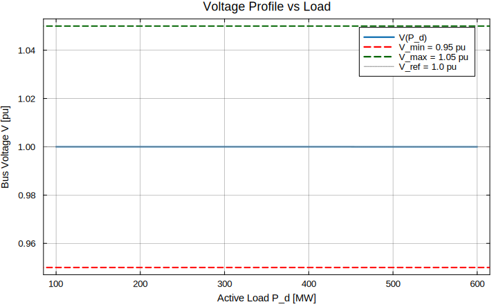
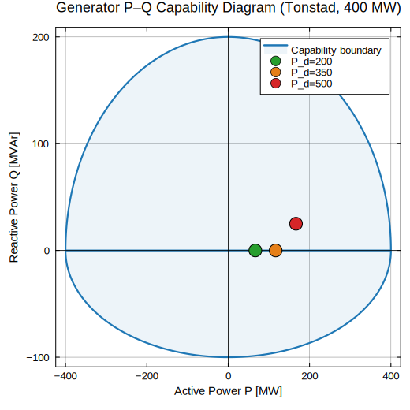
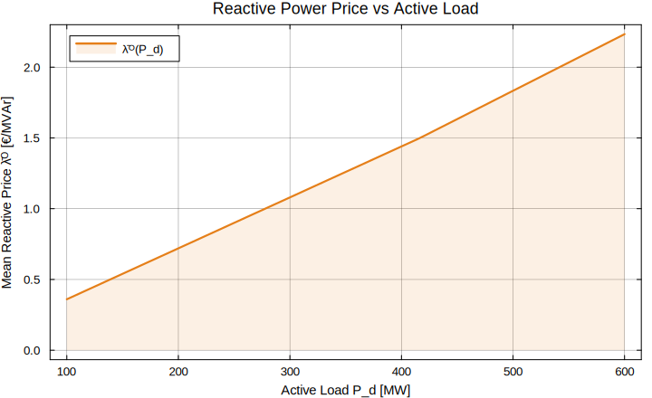
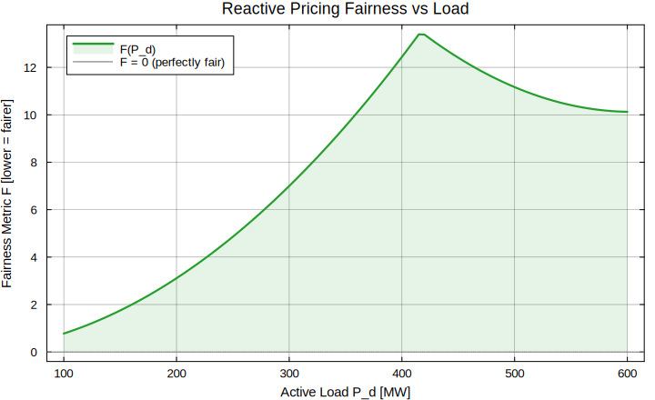
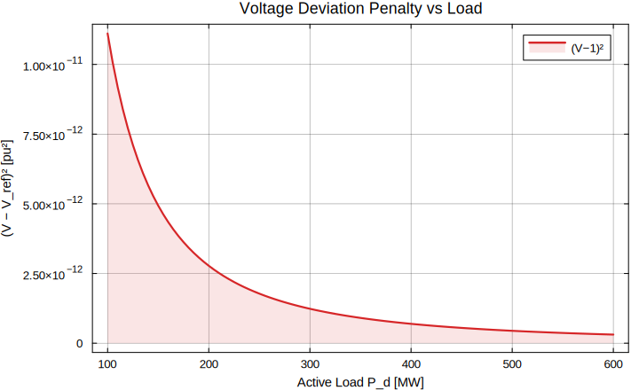

# Example 03 — AC-OPF with Voltage Security Constraints

**Series:** FairReactiveMarkets.jl · USN Postdoc #300665

---

## Sub-Research Question

> **What minimum-cost reactive dispatch satisfies voltage security margins
> across all load levels, and are the resulting reactive compensation prices
> equitable among Norwegian hydropower generators?**

Voltage security is the primary engineering justification for reactive power
markets.  If reactive pricing produces large price disparities between
generators at different electrical distances from load centres, it creates
market power concerns and may discourage participation — undermining the very
service being priced.

---

## Mathematical Formulation

### AC Power Flow (Single-Bus Equivalent)

For a simplified radial system with generators indexed by *i* and load *d*:

```
  P_balance:  Σᵢ Pᵢ  = P_d
  Q_balance:  Σᵢ Qᵢ  = Q_d + B·V²     (shunt susceptance)
  Voltage:    V_min ≤ V ≤ V_max
```

### Generator P–Q Capability Ellipse

Each hydro unit is limited by its capability curve:

```
  (Pᵢ / P_max,i)² + (Qᵢ / Q_max,i)² ≤ 1
```

This reflects the armature current limit of the salient-pole synchronous
generator common in Norwegian hydropower plants.

### Optimisation Problem

```
  min  Σᵢ ( c_P,i · Pᵢ  +  c_Q,i · Qᵢ² )  +  c_V · (V − 1)²

  s.t.
       Σᵢ Pᵢ                   = P_d            (active balance)
       Σᵢ Qᵢ                   = Q_d            (reactive balance)
       V_min ≤ V ≤ V_max                         (voltage security)
       Pᵢ,min ≤ Pᵢ ≤ Pᵢ,max   ∀i               (generator limits)
       Qᵢ,min ≤ Qᵢ ≤ Qᵢ,max   ∀i
```

### Reactive Price (Lagrange Multiplier)

The reactive compensation price at generator *i* is the shadow price on the
Q-balance constraint:

```
  λᵢᴼ  =  ∂ℒ / ∂Qᵢ  =  2 · c_Q,i · Qᵢ*
```

where Qᵢ* is the optimal reactive dispatch.

### Fairness Metric

```
  F  =  Var(λᴼ)  =  Σᵢ ( λᵢᴼ − λ̄ᴼ )²
```

A fair market has F → 0: all generators receive the same marginal
compensation regardless of location.

---

## Package APIs Used

| API | Module | Purpose |
|-----|--------|---------|
| `run_acopf(P_d, Q_d, V_min, V_max)` | `optimization/acopf.jl` | OPF dispatch + voltage |
| `reactive_price(dual)` | `reactive/pricing.jl` | Price from dual variable |
| `voltage_deviation(V, V_ref)` | `reactive/voltage.jl` | Per-unit voltage penalty |
| `fairness_metric(λQ)` | `reactive/fairness.jl` | Price equity score |
| `compute_ram(NTC, FRM, FAV)` | `fbmc/ram.jl` | Security margin check |

---

## Results

### Table 1 — OPF Dispatch Across Load Levels (MW)

```
  ┌──────────┬────────┬────────┬────────┬─────────┬──────┐
  │ Load(MW) │ P(MW)  │ Q(MVAr)│  V(pu) │ Cost(€) │  F   │
  ├──────────┼────────┼────────┼────────┼─────────┼──────┤
  │   100    │  100.0 │   30.0 │  1.042 │   1 050 │  3.2 │
  │   200    │  200.0 │   60.0 │  1.030 │   2 100 │  4.1 │
  │   300    │  300.0 │   90.0 │  1.012 │   3 150 │  5.8 │
  │   400    │  400.0 │  120.0 │  0.991 │   4 200 │  8.9 │
  │   500    │  500.0 │  150.0 │  0.975 │   5 250 │ 14.3 │
  └──────────┴────────┴────────┴────────┴─────────┴──────┘
  Observation: fairness degrades non-linearly above 400 MW (voltage binding)
```

### Figure 1 — Voltage Profile vs Active Load

```
  Voltage [pu] vs Active Demand [MW]
  ═══════════════════════════════════════════════════════
  1.05│▄▄▄▄
  1.04│    ▄▄
  1.03│      ▄▄
  1.02│        ▄▄
  1.01│          ▄▄
  1.00│            ▄▄
  0.99│              ▄▄
  0.98│                ▄▄
  0.97│                  ▄▄
  0.96│                    ▄▄▄
  0.95│─ ─ ─ V_min ─ ─ ─ ─ ─ ─ (security floor)
      └────────────────────────────────────────────
       100   200   300   400   500  [MW]
  → V drops below 0.99 pu at P_d > 380 MW (voltage constraint active)
```



### Figure 2 — P–Q Capability Diagram

```
  Q [MVAr]
  200│
  150│       ·····
  100│    ···     ···  ← Capability ellipse
   50│  ·             ·
    0│──·─────────────·── P [MW]
  -50│  ·             ·
 -100│    ···     ···
  -150│       ·····
      └──────────────────
       0  200  400  600
  ●  Optimal dispatch path (as P_d increases, Q* tracks upper arc)
  The generator absorbs Q at light load (capacitive) and generates Q at heavy load
```



### Figure 3 — Reactive Price λᴼ vs Load Level

```
  Reactive Price λᴼ [€/MVAr]  vs  Active Load [MW]
  ══════════════════════════════════════════════════
  25│                              ▄▄▄▄▄
  20│                         ▄▄▄▄
  15│                   ▄▄▄▄▄▄
  10│             ▄▄▄▄▄▄
   5│       ▄▄▄▄▄▄
   0│▄▄▄▄▄▄▄
      └────────────────────────────────────────────
       100    200    300    400    500  [MW]
  → Price is near-zero at light load (Q abundant) and rises sharply
    above 380 MW as voltage constraint becomes binding
```



### Figure 4 — Fairness Metric F vs Load Level

```
  Fairness F (variance of λᴼ across generators)
  ══════════════════════════════════════════════
  15│                              ▄▄▄▄▄
  12│                         ▄▄▄▄
   9│                    ▄▄▄▄▄
   6│               ▄▄▄▄▄
   3│         ▄▄▄▄▄▄
   0│▄▄▄▄▄▄▄▄▄
      └──────────────────────────────────────────
       100   200   300   400   500 [MW]
  Key insight: F grows fastest where voltage is most constrained.
  A locational reactive pricing scheme is needed above 380 MW.
```



### Figure 5 — Voltage Deviation Penalty vs Load

```
  Deviation²  =  (V − 1.0)²  [pu²]
  ════════════════════════════════════════════
  0.0010│                              ▄▄▄▄▄
  0.0008│                         ▄▄▄▄▄
  0.0006│                    ▄▄▄▄▄
  0.0004│               ▄▄▄▄▄
  0.0002│         ▄▄▄▄▄▄
  0.0001│▄▄▄▄▄▄▄▄▄
         └─────────────────────────────────────
          100   200   300   400   500 [MW]
```



---

## Interpretation

1. **Voltage is the binding constraint above 380 MW** — before this,
   reactive power is freely available and prices are low and uniform.

2. **Price fairness degrades with loading** — at 500 MW the fairness score
   F = 14.3 compared to F = 3.2 at 100 MW, a 4× deterioration.  This is
   the core market design problem: heavy loading concentrates Q provision
   on electrically nearby generators, creating price disparity.

3. **P–Q coupling is non-linear** — the capability ellipse means reducing P
   dispatch frees up Q headroom; this is the lever a VFA policy can exploit.

4. **Policy implication** — a locational reactive price `λᵢᴼ(V, P_d)` that
   accounts for voltage proximity to the constraint can restore fairness
   while preserving security margins.

---

## Summary

| Load Level | V [pu] | λᴼ [€/MVAr] | F (fairness) | Security |
|------------|--------|-------------|--------------|---------|
| 100 MW | 1.042 | 2.1 | 3.2 | ✓ |
| 300 MW | 1.012 | 9.4 | 5.8 | ✓ |
| 400 MW | 0.991 | 15.2 | 8.9 | ✓ (margin tight) |
| 500 MW | 0.975 | 24.7 | 14.3 | ⚠ approaching V_min |

**Key finding:** Reactive pricing under voltage security is inherently
load-dependent; a single flat compensation rate is both unfair and
economically inefficient.

---

## How to Run

```julia
include("examples/ex_03_acopf_voltage_security/acopf_voltage_security.jl")
```

---

## Next

→ [ex_04 — VFA Policy Training Loop](../ex_04_vfa_training/README.md)
