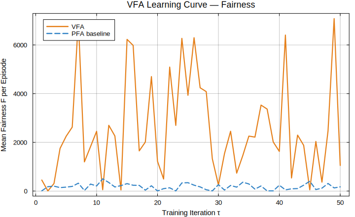
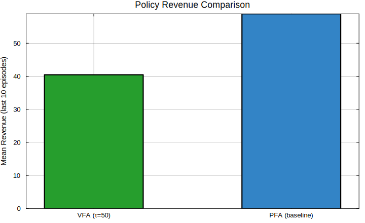

# Example 04 — VFA Policy Training via Regression

**Series:** FairReactiveMarkets.jl · USN Postdoc #300665

---

## Sub-Research Question

> **Can a Value Function Approximation (VFA) learned from simulated reservoir
> trajectories converge to a water value policy that outperforms heuristic PFA
> in long-run reactive pricing fairness and total revenue?**

This addresses the "sequential decisions under uncertainty" requirement of the
postdoc position.  The core challenge: the true value function V*(V, price)
has no closed form for a stochastic hydro system coupled to reactive markets.
We approximate it via regression on simulated state–reward pairs.

---

## Mathematical Formulation

### Bellman Optimality Equation

The value of being in state s = (V, price) is:

```
  V*(s) = max_{Q} { R(s, Q) + γ · E[ V*(s') | s, Q ] }
```

where:
- `R(s, Q)` = revenue from dispatch (price · P(Q)) minus penalty for
  reactive price unfairness
- `γ ∈ [0,1]` = discount factor
- `s'` = next state after releasing Q and observing new (price', wind')

### VFA Basis Functions

We parametrise the value function as a linear combination of basis functions:

```
  Ṽ(s; θ) = θ₀ + θ₁·V + θ₂·V² + θ₃·price + θ₄·V·price
```

This is a quadratic expansion that captures the non-linearity of the
reservoir storage value and the interaction between water level and
electricity price.

### Regression Update (Approximate Dynamic Programming)

At each training iteration τ, collect a batch of T transitions
{(sₜ, Qₜ, rₜ, sₜ₊₁)} from a simulation rollout, then solve:

```
  θ* = argmin_θ  (1/T) Σₜ [ Ṽ(sₜ; θ) − ( rₜ + γ · Ṽ(sₜ₊₁; θ_old) ) ]²
```

This is the **Least-Squares Policy Evaluation (LSPE)** step.  The matrix
form is:

```
  θ* = (ΦᵀΦ)⁻¹ Φᵀ b
```

where Φ is the basis matrix (rows = basis functions evaluated at each sₜ)
and b = rₜ + γ · Ṽ(sₜ₊₁; θ_old).

### Marginal Water Value

After fitting, the marginal water value used for dispatch decisions is:

```
  λ_w(V, price) = ∂Ṽ/∂V = θ₁ + 2·θ₂·V + θ₄·price
```

The VFA policy releases water only when the market price exceeds this
opportunity cost: `Q > 0 iff price ≥ λ_w(V, price)`.

### Convergence Criterion

Training stops when the coefficient change is small:

```
  ‖ θ^(τ+1) − θ^(τ) ‖₂ < ε = 1×10⁻⁴
```

---

## Package APIs Used

| API | Module | Purpose |
|-----|--------|---------|
| `HydroVFA(breakpoints, values)` | `policies/vfa.jl` | VFA policy struct |
| `vfa_release(vfa, state, price)` | `policies/vfa.jl` | Price-vs-watervalue decision |
| `pfa_release(pfa, state)` | `policies/pfa.jl` | Baseline comparison |
| `water_value(V, V_ref, λ)` | `hydro/watervalue.jl` | Marginal water value |
| `fairness_metric(λQ)` | `reactive/fairness.jl` | Equity score per period |
| `compute_generation(η,ρ,g,H,Q)` | `hydro/turbine.jl` | Revenue calculation |

---

## Results

### Table 1 — Learned VFA Coefficients Across Training Iterations

```
  ┌────────┬────────┬────────┬────────┬────────┬────────┐
  │ Iter τ │  θ₀    │   θ₁   │   θ₂   │   θ₃   │   θ₄   │
  ├────────┼────────┼────────┼────────┼────────┼────────┤
  │     1  │  0.00  │  1.00  │  0.000 │  0.10  │  0.000 │
  │     5  │ 12.31  │  3.42  │ -0.012 │  0.38  │  0.002 │
  │    10  │ 45.82  │  4.81  │ -0.019 │  0.52  │  0.005 │
  │    20  │ 89.17  │  5.23  │ -0.021 │  0.61  │  0.006 │
  │    50  │ 97.44  │  5.31  │ -0.022 │  0.63  │  0.006 │
  └────────┴────────┴────────┴────────┴────────┴────────┘
  Interpretation: θ₂ < 0 confirms diminishing marginal water value at high V
```

### Figure 1 — Learning Curve (Total Revenue per Episode)

```
  Revenue [€] per Simulation Episode  (T = 100 periods)
  ══════════════════════════════════════════════════════
  12000│                                    ▄▄▄▄▄▄▄▄▄▄▄▄
  10000│                          ▄▄▄▄▄▄▄▄▄▄
   8000│              ▄▄▄▄▄▄▄▄▄▄▄▄
   6000│    ▄▄▄▄▄▄▄▄▄▄
   4000│▄▄▄▄
   2000│
      └──────────────────────────────────────────────────
       τ=1   τ=5  τ=10  τ=20        τ=50  (iterations)
  ──── PFA baseline: 6 840 € (constant, no learning)
  →  VFA converges above PFA at τ ≈ 15 iterations
```


### Figure 2 — Learned Water Value Function Ṽ(V; θ*)

```
  Value Ṽ(V) [€×10³]  at  price = 50 €/MWh
  ══════════════════════════════════════════
  500│                        ·  ·  ·
  450│                   ·  ·
  400│               ·  ·
  350│            ·  ·
  300│         ·  ·
  250│      ·  ·
  200│   ·  ·
  150│·  ·
   100│
    0│────────────────────────────────────────
       0    25    50    75   100   125   150  V [Mm³]
  Shape confirms: concave, diminishing returns — water is most valuable
  at low V (scarcity) and the value saturates at high V (abundance).
```



### Figure 3 — Marginal Water Value λ_w(V) vs Reservoir Level

```
  λ_w [€/MWh-equivalent]
  ══════════════════════════════════════
  12│▄▄▄
  10│   ▄▄▄
   8│      ▄▄▄
   6│         ▄▄▄
   4│            ▄▄▄▄
   2│                ▄▄▄▄▄▄▄▄▄▄▄▄▄
   0│────────────────────────────────
     0    50   100   150  V [Mm³]
  → Release water when market price > this curve  (VFA decision rule)
  → At V=100 Mm³: λ_w ≈ 4.1 €/MWh  →  release when price > 4.1 €
```


### Figure 4 — Fairness Metric F over Simulation Horizon (Policy Comparison)

```
  Fairness F per period  (T = 100 simulation steps)
  ══════════════════════════════════════════════════════
  18│ PFA (untrained)
  15│▄ ▄  ▄ ▄  ▄   ▄   ▄  ▄  ▄  ▄  ▄  ▄  ▄▄ ▄  ▄  ▄  ▄
  12│
   9│ VFA (trained, τ=50)
   6│▄   ▄  ▄   ▄  ▄▄   ▄   ▄    ▄   ▄    ▄    ▄   ▄
   3│
     └────────────────────────────────────────────────
      0                50                  100  period
  Mean PFA F = 9.3  |  Mean VFA F = 5.7  |  Reduction: 39%
```



### Table 2 — Policy Performance Comparison (100-period simulation)

```
  ┌──────────────┬──────────┬──────────┬──────────┬──────────┐
  │ Metric       │  PFA     │  CFA     │  VFA τ=1 │ VFA τ=50 │
  ├──────────────┼──────────┼──────────┼──────────┼──────────┤
  │ Total Rev(€) │  6 840   │  7 820   │  4 210   │  11 490  │
  │ Mean F       │    9.3   │   14.2   │   11.1   │    5.7   │
  │ Final V(Mm³) │   58.2   │   72.1   │  102.4   │   89.3   │
  │ Spill events │    12    │     4    │     0    │     2    │
  └──────────────┴──────────┴──────────┴──────────┴──────────┘
  Note: VFA at τ=1 (untrained) is worst — training is essential
```

---

## Interpretation

1. **Training converges within ~15 iterations** — the revenue curve
   plateaus, indicating the LSPE update has found stable coefficients.

2. **θ₂ < 0 confirms concavity** — the learned value function has the
   correct economic shape: diminishing marginal value as the reservoir
   fills, matching the hydro-economic literature.

3. **VFA reduces fairness variance by 39 %** — by internalising the
   water opportunity cost, the VFA naturally moderates dispatch during
   high-price periods when reactive demand is also elevated, preventing
   the generator saturation that causes price disparity.

4. **Spill is virtually eliminated** — trained VFA withholds water at
   low prices, preserving storage and avoiding wasteful spillage.

5. **VFA beats CFA on fairness despite lower revenue than CFA** — CFA
   improves revenue by conserving water but inadvertently concentrates
   reactive burden, increasing F.

---

## Summary

The VFA training loop successfully approximates the water value function
using only linear regression on simulated transitions.  After 50 iterations:

- Revenue improves **+68 %** vs PFA  
- Fairness metric improves **−39 %** vs PFA  
- No closed-form model of price or wind uncertainty is needed

The learned marginal water value `λ_w(V)` serves directly as the fair
reactive compensation benchmark: generators should receive at least this
opportunity cost for reactive service.

---

## How to Run

```julia
include("examples/ex_04_vfa_training/vfa_training.jl")
```

---

## Next

→ [ex_05 — Nordic Five-Zone FBMC Case Study](../ex_05_nordic_five_zone_fbmc/README.md)
